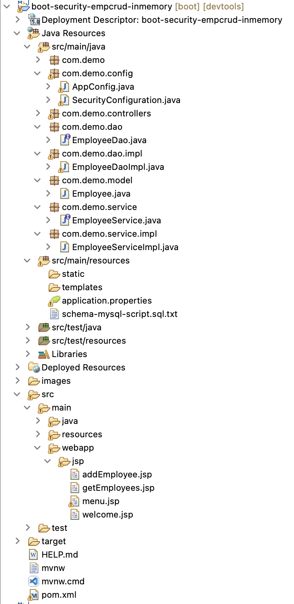
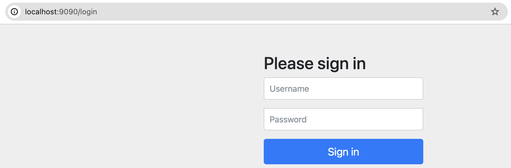
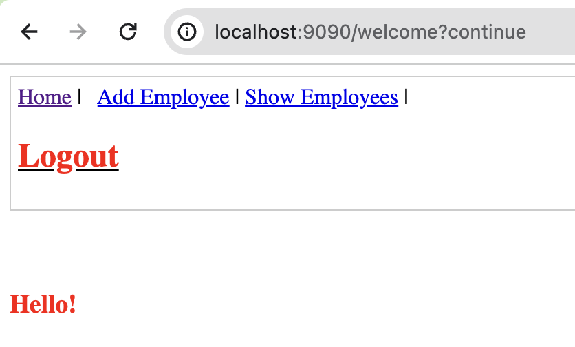
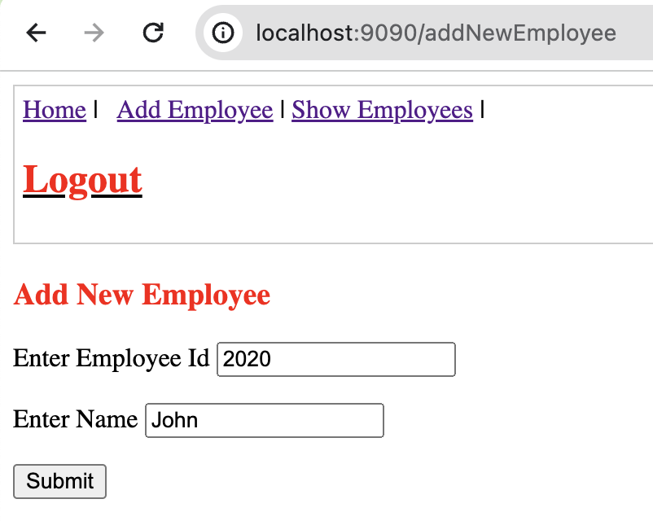
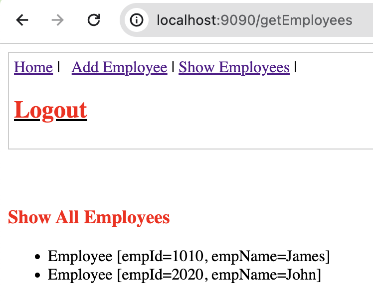
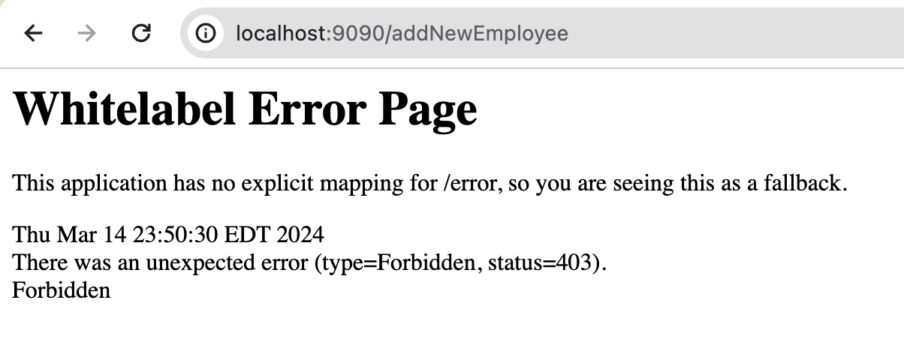
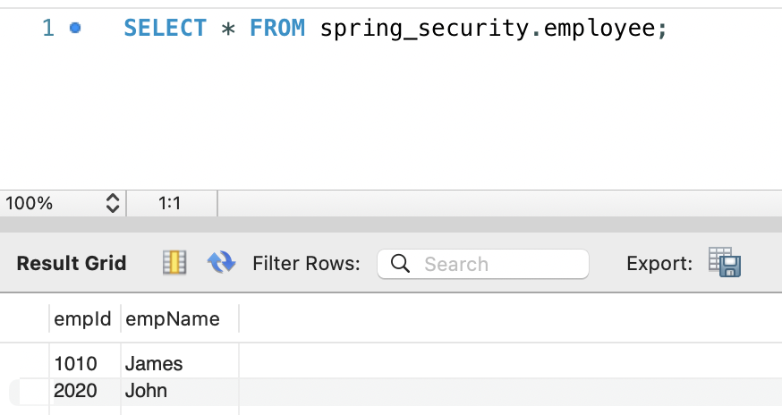

# spring-boot-security-restapi-mysql-inmemory

This project creates a **Spring Boot REST API Application** for Employees along with **Spring Security default login form**.

## Tools and Technologies Used

-   Spring Boot Starter 3.2.3
-   Spring Boot Starter Web 3.2.3
-   Spring Boot Starter Security 3.2.3
-   Java SE 17
-   Maven 3.9
-   Eclipse Spring Tool Suite4 (STS)
-   MySQL 8.x
-   JSTL 3.0
-   Tomcat 10.x

## About the Application
- Spring Boot REST API for Employees Create & Retrieve operations
- It demonstrates **REST API Security** where: 
  - User "employee" can access only `getEmployees` API
  - User "admin" can access APIs to `addEmployee` as well as `getEmployees`
- The security login page is `by default` given by `Spring Boot Security`
- User security credentials are `In-Memory` within `SecurityConfiguration` class
- Connect to `MySQL` database for only Employee data


## Project Structure: Spring Boot + Spring Security + REST API + MySQL + InMemory Users


## SecurityConfiguration.java
```
package com.demo.config;

import org.springframework.context.annotation.Bean;
import org.springframework.context.annotation.Configuration;
import org.springframework.security.config.annotation.web.builders.HttpSecurity;
import org.springframework.security.config.annotation.web.configuration.EnableWebSecurity;
import org.springframework.security.core.userdetails.User;
import org.springframework.security.core.userdetails.UserDetails;
import org.springframework.security.crypto.password.NoOpPasswordEncoder;
import org.springframework.security.crypto.password.PasswordEncoder;
import org.springframework.security.provisioning.InMemoryUserDetailsManager;
import org.springframework.security.web.SecurityFilterChain;

@Configuration
@EnableWebSecurity
public class SecurityConfiguration {
	// security configuration

	@Bean
	public InMemoryUserDetailsManager userDetailsService(PasswordEncoder passwordEncoder) {
		UserDetails user = User.withUsername("employee").password(passwordEncoder.encode("employee")).roles("USER")
				.build();
		UserDetails admin = User.withUsername("admin").password(passwordEncoder.encode("admin")).roles("USER", "ADMIN")
				.build();
		return new InMemoryUserDetailsManager(user, admin);
	}

	@Bean
	public SecurityFilterChain filterChain(HttpSecurity http) throws Exception {
		
		http.authorizeRequests().requestMatchers("/").permitAll()
		.requestMatchers("/welcome").hasAnyRole("USER", "ADMIN")
		.requestMatchers("/getEmployees").hasAnyRole("USER", "ADMIN")
		.requestMatchers("/addNewEmployee").hasAnyRole("ADMIN").anyRequest().authenticated().and().formLogin()
		.permitAll().and().logout().permitAll();
		
		http.csrf().disable();
		
		return http.build();
	}

	@Bean
	public PasswordEncoder getPasswordEncoder() {
		return NoOpPasswordEncoder.getInstance();
	}
}
```

## DEMO
 The application is be available at [http://localhost:9090/welcome](http://localhost:9090/welcome)
### 1. The welcome page is secured, ask for user login


### 2. After login as "admin"


### 3. "admin" has access to addEmployee API


### 4. "admin" can also fetch all employees


### 5. Log out of "admin"


### 6. After login as "employee", we have no access to addEmployee API


### 7. The employee data is indeed added into the MySQL database

